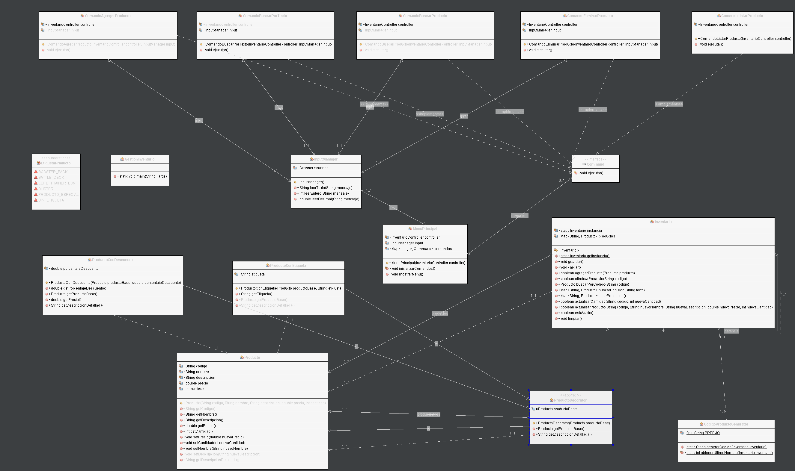
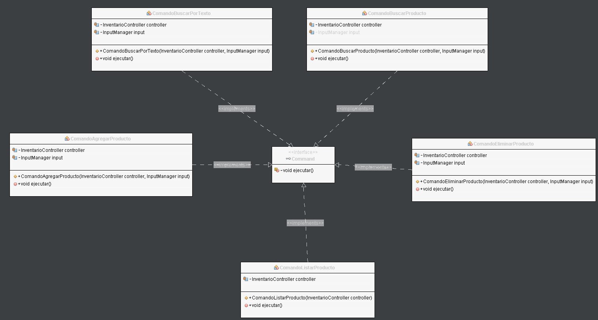
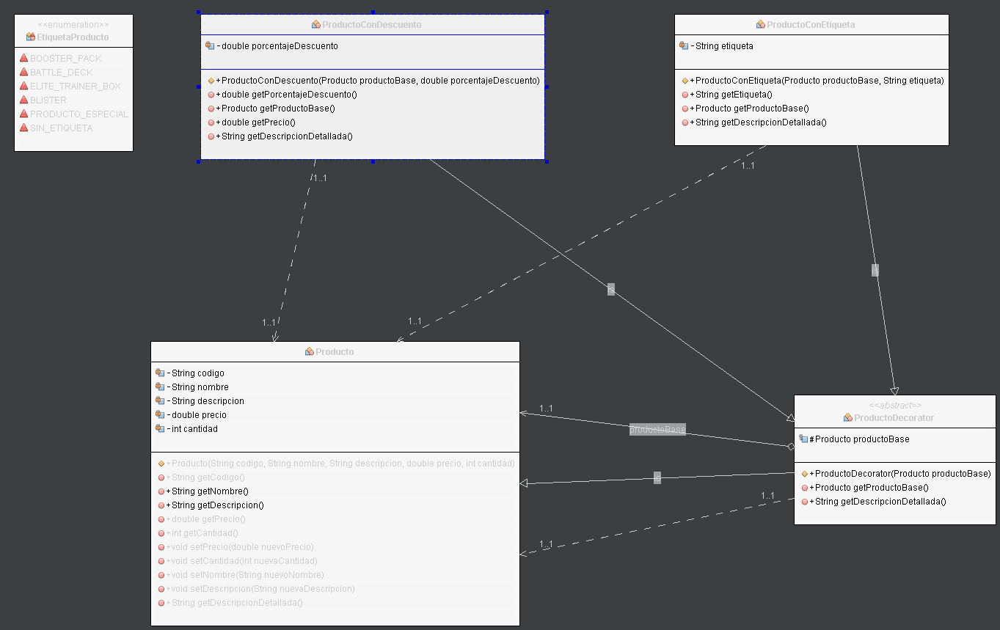

# Experiencia 2 – Semana 5
## Utilizando herramientas de trabajo colaborativo

Proyecto desarrollado en Java como parte del curso **Programación Orientada a Objetos II (PRY2203)**. El sistema permite gestionar un inventario de productos, aplicando patrones de diseño y buenas prácticas de arquitectura.

---

## 📚 Índice

1. [Requisitos del Sistema](#requisitos-del-sistema)  
2. [Diseño y Arquitectura](#diseño-y-arquitectura)  
3. [Implementación](#implementación)  
4. [Pruebas](#pruebas)  
5. [Despliegue](#despliegue)  
6. [Documentación Técnica](#documentación-técnica)  
7. [Mantenimiento y Evolución](#mantenimiento-y-evolución)

---

## 📝 Requisitos del Sistema

### Funcionales
- Agregar, buscar, modificar y eliminar productos.
- Aplicar decoradores como etiquetas y descuentos.
- Persistencia automática en archivo CSV.
- Carga de inventario al iniciar el sistema.

### No Funcionales
- Portabilidad sin configuración adicional.
- Validación de formato en CSV.
- Modularidad y documentación del código.
- Pruebas automatizadas con Maven y JUnit.

---

## 📐 Diseño y Arquitectura

El sistema está organizado en paquetes:

```
GestionInventario/
├── src/
│   ├── main/
│   │   └── java/
│   │       └── com/duoc/GestionInventario/
│   │           ├── GestionInventario.java
│   │           ├── command/                  
│   │           │   ├── ComandoActualizarProducto.java
│   │           │   ├── ComandoAgregarProducto.java
│   │           │   ├── ComandoBuscarPorTexto.java
│   │           │   ├── ComandoBuscarProducto.java
│   │           │   ├── ComandoEliminarProducto.java
│   │           │   ├── ComandoListarProducto.java
│   │           │   └── Command.java
│   │           ├── controller/           
│   │           │   └── Inventario.java
│   │           │   └── InventarioController.java
│   │           ├── model/                     
│   │           │   ├── EtiquetaProducto.java
│   │           │   ├── Producto.java
│   │           │   ├── ProductoConDescuento.java
│   │           │   ├── ProductoConEtiqueta.java
│   │           │   └── ProductoDecorator.java
│   │           ├── util/                        
│   │           │   ├── CodigoProductoGenerator.java
│   │           │   ├── InputManager.java
│   │           │   ├── InventarioCsvManager.java
│   │           │   └── ProductoUtils.java
│   │           └── view/
│   │               └── MenuPrincipal.java  
│   │
│   └── test/
│       └── java/
│           └── com/duoc/GestionInventario/
│               ├── controller/
│               │   ├── InventarioIntegracionTest.java
│               │   └── InventarioTest.java
│               └── model/
│                   ├── ProductoDecoratorTest.java
│                   ├── ProductoTest.java
│                   └── ProductoUtilsTest.java
│
├── data/
│   └── inventario.csv
├── docs/
├── pom.xml
└── README.md
```

- `model`: clases de dominio y decoradores
- `controller`: lógica del inventario
- `command`: acciones encapsuladas (Command Pattern)
- `util`: utilidades como manejo de CSV y generación de códigos
- `view`: menú principal (modo consola)

### 📊 Diagrama UML del sistema

- Diagrama general del sistema


- Diagrama paquete command


- Diagrama paquete model


### Patrones aplicados
- **Singleton**: `Inventario`
- **Decorator**: `ProductoConEtiqueta`, `ProductoConDescuento`
- **Command**: `ComandoAgregarProducto`, `ComandoEliminarProducto`, etc.

---

## 💻 Implementación

- Proyecto Maven con estructura estándar.
- Uso de `Map<String, Producto>` para gestión eficiente.
- Decoradores aplicados dinámicamente.
- Persistencia en `data/inventario.csv`.

---

## 🧪 Pruebas

### Unitarias
- `ProductoTest`: creación, modificación de atributos.
- `InventarioTest`: agregar, eliminar, buscar, listar.
- `ProductoDecoratorTest`: Valida la aplicación de decoradores como etiquetas y descuentos, asegurando que no se acumulen incorrectamente.
- `ProductoUtilsTest`: Prueba métodos utilitarios como **actualizarProductoDecorado**, **generarCodigo**, y **limpiarDecoradores**, garantizando consistencia y robustez.


### Integración
- `InventarioIntegracionTest`: flujo completo entre `Producto` e `Inventario`.

### Resultado
- Todas las pruebas ejecutadas con `mvn test`
- Estado: `BUILD SUCCESS`

---

## 🚀 Despliegue

### Requisitos
- JDK 21
- Maven
- NetBeans 25 o compatible

### Instrucciones
1. Clonar o descomprimir el proyecto.
2. Ejecutar `mvn clean install` para compilar y testear.
3. Ejecutar `GestionInventario` desde el IDE.

---

## 📄 Documentación Técnica

La documentación Javadoc se encuentra en:
- target/reports/apidocs/index.html

Incluye descripción de clases, métodos y atributos.

---

## 🔧 Mantenimiento y Evolución

### Mejoras aplicadas
- Validación de entradas nulas.
- Se agregaron pruebas para verificar funcionamiento de decoradores.
- Refactorización comandos de modificación de productos.
- Modificación de almacenamiento de datos, la carpeta data se saco del proyecto preparándose asi para una migración a base de datos

### Propuestas futuras
- Interfaz gráfica con JavaFX.
- Migración a base de datos con JDBC.
- Refactorización hacia MVC completo.

---

## 📌 Autor

**Miguel [Arica, Chile]**  
Curso: Programación Orientada a Objetos II  
Institución: Duoc UC  
Año: 2025
