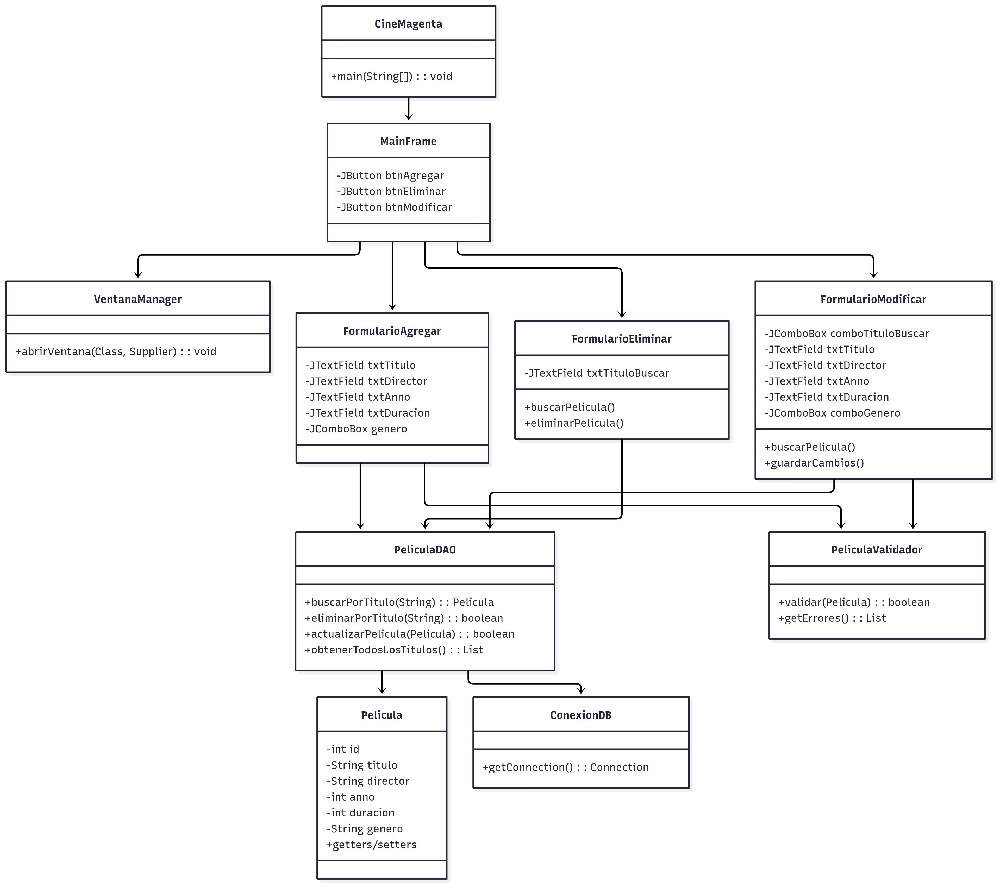

# Experiencia 3 – Semana 6
# 🎬 CineMagenta — Prototipo de Gestión de Cartelera Cinematográfica

## 📌 Descripción del proyecto

**CineMagenta** es una aplicación Java con interfaz gráfica que permite gestionar una cartelera de películas almacenadas en una base de datos MySQL. Este prototipo fue desarrollado como parte de una evaluación formativa, cumpliendo los requisitos de creación de base de datos, interfaz principal y formulario de ingreso de películas.

El proyecto está diseñado con enfoque en modularidad, validación de datos, y experiencia de usuario, y se encuentra en fase de desarrollo incremental.

---

## 🗂️ Estructura del repositorio

```
Proyecto cineMagenta/ 
├── CineMagenta/                          # Proyecto Java creado en NetBeans 
│   ├── src/ 
│   │   ├── dao/                          # PeliculaDAO 
│   │   │   └── PeliculaDAO.java
│   │   ├── model/                        # Clase Pelicula 
│   │   │   └── Pelicula.java  
│   │   ├── util/                         # ConexionDB y PeliculaValidador 
│   │   │   ├── ConexionDB.java
│   │   │   ├── PeliculaValidador.java 
│   │   │   └── VentanaManager
│   │   ├── view/                         # MainFrame y Formularios
│   │   │   ├── FormularioAgregar.java 
│   │   │   ├── FormularioEliminar.java 
│   │   │   ├── FormularioModificar.java 
│   │   │   └── MainFrame.java
│   │   └── resources/                    # Recursos gráficos para la interfaz
│   ├── nbproject/                       
│   ├── build.xml                        
│   └── manifest.mf                        
├── docs/                                 # Documentación técnica 
│   ├── Cine_DB.sql        
│   ├── UML_CineMagenta    
│   └── javadoc/ 
├── lib/                                  # Contiene archivos .jar necesarios para el proyecto
└── README.md          
```
---

## 🗄️ Base de datos

- **Nombre**: `Cine_DB`
- **Tabla**: `Cartelera`
- **Campos**:
  - `id` (INT, autoincremental)
  - `titulo` (VARCHAR(150))
  - `director` (VARCHAR(50))
  - `anno` (INT, NOT NULL)
  - `duracion` (INT, minutos)
  - `genero` (ENUM: Acción, Comedia, Drama, Suspenso, Terror, Animación)

El script de creación se encuentra en [`docs/Cine_DB.sql`](docs/Cine_DB.sql).

---

## 🖥️ Funcionalidades implementadas

- **Interfaz principal (`MainFrame`)** con barra de herramientas

- **Formulario “Agregar película”** con:
  - Validación de campos vacíos
  - Botón “Limpiar”
  - Inserción real en MySQL usando `PeliculaDAO`
  - Cuadros de diálogo para retroalimentación
- **Formulario “Modificar película”** con:
  - Búsqueda por título con carga automática de campos
  - Campos editables: título, director, año, duración, género
  - Género disponible como lista desplegable
- **Formulario “Eliminar película”** con:
  - Búsqueda por título con confirmación previa
  - Validación de existencia antes de eliminar
  - Mensajes de éxito o error según el resultado

---

## 📐 Diagrama UML

El diagrama UML del sistema se encuentra en la carpeta [`docs/UML_CineMagenta.png`](docs/UML_CineMagenta.png). Este representa las clases principales del modelo, DAO, y flujo de interacción entre la interfaz gráfica y la base de datos.


---

## 📚 Documentación Javadoc

La documentación técnica generada con Javadoc esta disponible en la carpeta [`docs/javadoc/`](docs/javadoc/). 

---

## ⚙️ Requisitos técnicos

- **Java 8+**
- **MySQL 8.0+**
- **Driver JDBC MySQL** (`mysql-connector-java`)
- **IDE recomendado**: NetBeans, IntelliJ o Eclipse

---

## 🚀 Cómo ejecutar

1. Clona o descarga el repositorio.
2. Abre el proyecto `CineMagenta` en NetBeans.
3. Asegúrate de tener MySQL corriendo y ejecuta el script `docs/Cine_DB.sql`.
4. Configura correctamente la clase `ConexionDB` con tus credenciales.
5. Ejecuta `CineMagenta.java` para iniciar la interfaz.

---

## 🧭 Próximos pasos

- Implementar formularios para listar y buscar películas.
- Mejorar la experiencia visual y navegación de la interfaz.
- Validar duplicación de `id` si se permite ingreso manual.

---

**Autor**: Miguel Vargas  
**Fecha**: Septiembre 2025  
